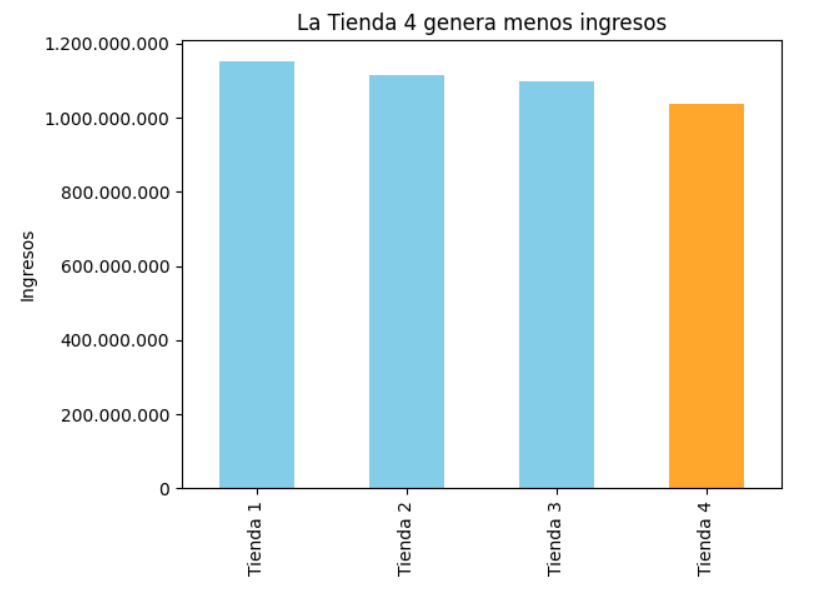

# 🏪 Informe Final de Análisis de Tiendas

## 📊 Propósito del análisis
El objetivo de este análisis es determinar **qué tienda debería vender el Sr. Juan**, considerando diversos factores de desempeño comercial.  
A lo largo del estudio se evaluaron las **cuatro tiendas actuales**, con base en datos de ingresos, ventas por categoría, calificaciones de clientes, productos más y menos vendidos, y costos de envío promedio.  

Este informe resume los hallazgos principales y presenta una recomendación final, **respaldada en datos y visualizaciones generadas durante el análisis**.

---

## ⚙️ Requisitos del proyecto
Para reproducir este análisis en Google Colab o localmente, se requieren los siguientes elementos:

- 🐍 **Python 3.10+**
- 📦 Librerías principales:
  - `pandas`
  - `matplotlib`
  - `seaborn`
  - `folium`

---

## 📈 Resumen del análisis
Durante el estudio se compararon los siguientes aspectos:

- **Ingresos totales por tienda**  
- **Categorías de productos más y menos vendidas**  
- **Calificación promedio de clientes**  
- **Productos con mayores y menores ventas**  
- **Costo de envío promedio**

Los resultados muestran que **las diferencias entre tiendas son mínimas** en la mayoría de los criterios, **excepto en los ingresos totales**, donde se observa una brecha significativa entre las dos tiendas de peor rendimiento.

---

## 💡 Recomendación final

👉 **Se recomienda vender la *Tienda 4*.**

### 🧾 Justificación:
- La **Tienda 4 presenta los ingresos totales más bajos**, con una diferencia de **💲59.643.900** pesos colombianos respecto a la siguiente tienda con menor rendimiento.  
- En los demás indicadores (categorías vendidas, calificaciones, costos de envío), las diferencias son **poco relevantes o marginales**, por lo que **no alteran la decisión final**.
- Mantener las tiendas con mejor facturación permitirá **optimizar los recursos y maximizar el retorno de inversión.**

---

## 🧭 Conclusión
Tras el análisis integral de todas las variables, la **Tienda 4** se posiciona como la **menos rentable** y, por tanto, la **mejor opción para ser vendida**.  
Esta decisión se basa principalmente en la **brecha de ingresos**, dado que otros factores no muestran diferencias significativas entre tiendas.

---

## ✨ Autor
**Cristian Prieto**  
📅 Proyecto propuesto por ALURA LATAM — *Análisis de datos de tiendas*  
💬 “Los datos cuentan la historia; el análisis decide el futuro.”
